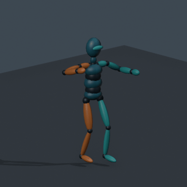
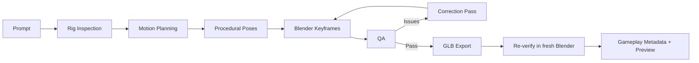
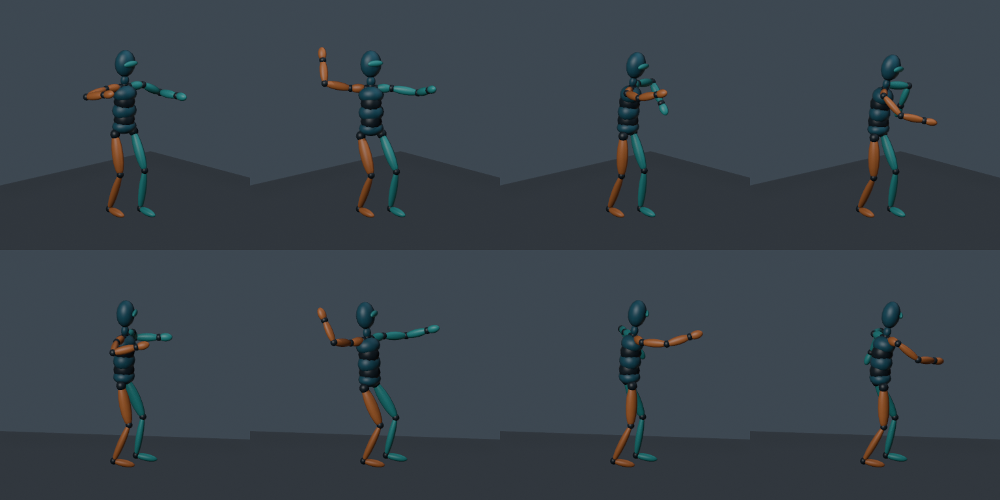

<p align="center">
  <picture>
    <source media="(prefers-color-scheme: dark)" srcset="assets/branding/logo-dark.svg">
    
  </picture>
</p>

<p align="center">
  <b>AI-powered animation direction for game characters.</b><br>
  <sub>Direct. Animate. Validate. Ship.</sub>
</p>

<p align="center">
  Give Claude a rigged 3D character and describe the motion you want.<br>
  Motion Director uses <b>Blender in the background</b> to generate, validate, and export a
  playable animation clip — <b>no external motion-AI API required</b>.
</p>

<p align="center">
  
  
  
  
  
  
  
  
</p>

<br>

## From prompt to playable animation

<p align="center">
  
</p>

```text
Prompt
"Bu karakter için güçlü bir mızrak fırlatma animasyonu yap."
("Create a powerful spear throw animation for this character.")
```

```text
✓ Humanoid rig detected — 18 bones mapped
✓ 8 motion poses generated (Ready → Anticipation → WindUp → Drive → Release → FollowThrough → Settle → Recovery)
✓ 18 bones animated, 46 baked frames
✓ projectile_release event @ 0.38s (frame 19)
✓ QA passed — 10/10 numerical checks, 0 correction passes needed
✓ GLB exported and re-verified in a fresh Blender process
```

*The GIF above is the actual `spear_throw_preview` render produced by this pipeline — not a mockup.*

<br>

## 🎬 What is Motion Director?

Motion Director is **not an analysis tool**. It is a Claude skill and local CLI that turns a
description of a move into a real, playable animation on your own character.

When you say *"make this character throw a spear"*, Motion Director:

1. inspects the character's rig and maps it to a canonical humanoid skeleton
2. breaks the motion into weighted, timed phases
3. drives headless Blender to generate real procedural keyframes
4. builds an actual animation clip (not a description of one)
5. runs numerical QA against the result, and self-corrects once if needed
6. exports a verified `.glb`
7. emits gameplay event metadata (e.g. *when* the spear leaves the hand)
8. renders a preview so you can see what was made

```text
Traditional pipeline:
  Idea → animator → open Blender → find rig → hand-key → review → export

Motion Director:
  "Make a spear throw animation." → GLB
```

## ⚡ Why Motion Director?

Animation is usually the most expensive place to iterate in a game pipeline: it needs an
animator, rig familiarity, Blender expertise, and tight synchronization with gameplay timing —
and every revision pays that cost again. Motion Director makes that loop agent-friendly: describe
the motion, get back a verified, timed, game-ready clip.

## 🧩 Current MVP

What exists **today**, not on a roadmap:

- Claude skill + standalone `motion-director` CLI
- Local Blender 4.x/5.x integration (headless, background-mode)
- GLB/glTF humanoid inspection: armature, binding, weights, hierarchy, existing clips
- Humanoid bone-name normalization (namespaces, `.L/.R`, Left/Right, Mixamo, Bip01) with manual
  mapping overrides
- Procedural, right-handed **spear throw** generation
- Multi-bone keyframes baked with real `keyframe_insert()` calls across 18 bones
- 8-pose motion recipe (Ready, Anticipation, WindUp, Drive, Release, FollowThrough, Settle, Recovery)
- Gameplay event metadata (`projectile_release`) with exact time and frame
- Automatic numerical QA (elbow range, extension, torso rotation, foot stability, rotation
  continuity, whole-body participation, duration, event timing)
- One conservative self-correction pass on QA failure
- Verified GLB export — reopened and re-checked in a fresh Blender process before it's published
- MP4 preview (PNG sequence fallback) and a 4-pose × 2-angle contact sheet
- No external AI API, no network calls, no cloud generation, no mocap service

## 🚀 Quick Start

```bash
git clone <your-repository-url> motion-director
cd motion-director
python -m pip install -e .
```

```powershell
motion-director doctor
motion-director inspect character.glb
motion-director create-animation character.glb "Güçlü bir mızrak fırlatma animasyonu yap" --preview
motion-director validate output/character_spear_throw.glb
```

Every command accepts `--json`. Outputs are never overwritten — pick a fresh `--output` directory
for another attempt. See [Requirements and Blender Setup](#requirements-and-blender-setup) below
for Blender detection details.

**Try it on the bundled demo character** — `examples/humanoid.glb` is an original, MIT-licensed,
19-bone skinned mannequin (right limbs orange, left limbs teal — the same rig used in the GIF and
pose sheet above):

```bash
motion-director create-animation examples/humanoid.glb \
  "Bu karakter için güçlü bir mızrak fırlatma animasyonu yap." \
  --output output/demo --preview
```

## 🎯 Claude Skill

Motion Director ships as a real Claude Code skill, driven from natural language:

```text
User:
Bu karakter için güçlü bir mızrak fırlatma animasyonu yap.

Claude:
→ motion-director skill
→ rig inspection (Blender, headless)
→ procedural pose planning
→ Blender keyframe generation
→ numerical QA (+ correction pass if needed)
→ GLB export + re-verification
→ preview + gameplay metadata delivered
```

Install the **complete repository**, including `SKILL.md` and `motion_director/`, at:

- Project scope, Claude Code: `.claude/skills/motion-director/`
- Personal scope, Claude Code: `~/.claude/skills/motion-director/`

Then install it as a package: `python -m pip install -e "<skill-directory>"`. Do not copy only
`SKILL.md` — the executable implementation is part of the skill, and Claude needs local shell and
filesystem access to your machine and Blender install. Full workflow: [SKILL.md](SKILL.md).

## 🛠 How It Works



Every stage runs locally against a disposable, background Blender process — nothing leaves your
machine.

## 🏹 Spear Throw Pipeline

The MVP's one fully-supported move, broken into 8 timed phases:

```text
Ready → Anticipation → WindUp → Drive → Release → FollowThrough → Settle → Recovery
```

<p align="center">
  
</p>

Hips lead the chest into the release; the off-hand counterbalances; both legs shift weight; the
neck and head hold the heading. The gameplay-critical moment is published as a timed event:

```text
projectile_release → 0.38s (frame 19, at the default 50 fps)
```

## 📦 Output Files

```text
output/
├── humanoid_spear_throw.glb      # real skinned animation clip (verified, re-imported)
├── spear_throw.motion.json       # poses, frames, gameplay event, rig mapping, QA, SHA-256
├── spear_throw_report.md         # human-readable mapping, timings, measurements, limitations
├── spear_throw.blender.py        # generated Blender entry script (reproducible)
├── spear_throw.job.json          # exact procedural recipe behind the clip
├── spear_throw_preview.mp4       # studio preview (2 angles), when video encoding is available
├── spear_throw_poses.png         # 4-pose × 2-angle contact sheet
└── preview_poses/                # individual pose renders
```

## 🎮 Gameplay Metadata

`spear_throw.motion.json` ships a real gameplay event alongside the clip:

```json
{
  "animation": "SpearThrow",
  "fps": 50,
  "duration": 0.9,
  "events": [
    { "name": "projectile_release", "time": 0.38, "frame": 19 }
  ]
}
```

glTF has no standard mechanism for gameplay events, so Motion Director ships one as a JSON
sidecar instead of guessing at engine-specific conventions. Your game reads `projectile_release`
to know exactly when to detach or spawn the spear — no more hand-scrubbing a timeline to find the
release frame. No spear mesh or projectile is added to the export; this is timing metadata only.

## 🧪 Validation / QA

Motion Director doesn't just generate — it checks its own work before calling anything done:

- finite transforms, unit bone scale
- elbow range, release arm extension
- torso rotation, foot stability (drift from the planted stance)
- rotation continuity, whole-body participation
- duration and release-event timing
- broken-pose detection, with **one** conservative self-correction pass on failure

A failed QA pass after correction produces a diagnostic JSON and a nonzero exit — never a claimed,
working GLB that isn't actually verified.

```bash
python -m pip install -e ".[dev]"
pytest
ruff check .
```

```text
48 passed, 1 skipped in ~31s
6 real Blender integration tests (skip cleanly when Blender is not installed)
ruff check . — all checks passed
```

These numbers come from this repository's own test suite, run against a real local Blender
install — not aspirational figures.

## 🏗 Architecture

```text
motion_director/
├── cli.py       # motion-director command (doctor / inspect / create-animation / validate)
├── pipeline.py  # orchestrates inspect → plan → generate → QA → export
├── doctor.py    # Blender environment diagnostics
├── gltf.py      # standalone GLB/glTF binary reader used for export verification
├── paths.py     # output staging, hashing, path safety
├── rig/         # humanoid bone-name normalization and mapping
├── motion/      # spear throw pose planning and numerical validation
├── blender/     # headless Blender entry points (animate, export, inspect, preview, locate)
└── qa/          # numeric pose QA checks
```

## 🎓 Philosophy

**Animation as direction, not manual tooling.** Motion Director's goal isn't to replace Blender —
it's to let you describe motion *intent* instead of low-level transforms:

```text
Instead of:
  Rotate upper_arm.R by 42° at frame 18

Say:
  "Give the throw more anticipation and weight."
```

## 🗺 Roadmap

**v0.1 — MVP (current)**
Humanoid inspection · Blender automation · spear throw generation · numerical QA · verified GLB export

**v0.2 — Combat Motion Pack**
Sword slash · bow shot · spell cast · hit reaction · death animation

**v0.3 — Motion Grammar**
Generalized phase recipes for throw / melee / cast / locomotion / reaction families

**v0.4 — Game Engine Integration**
Godot · Unity · Bevy import helpers

**Future**
Retargeting · IK · weapon-aware motion · multi-character interaction · optional external motion providers

## ⚠️ Limitations

Being honest about where this stands today:

- Only right-handed spear throw. Text selects a deterministic recipe, not open-ended semantic
  motion generation. No FBX, automatic rigging, mocap, facial, or detailed finger animation.
- Validated on an articulated skinned mannequin and transformed rig variants — not yet against a
  broad set of production characters. Bad weights, unusual proportions, severe rest-pose
  deviations, twist chains, or helper/control rigs may need adaptation.
- QA is numerical/heuristic. Mesh self-intersection, hand grip, and shoulder deformation still
  need visual review. Foot QA measures drift from the starting stance, not terrain collision.
- No GUI, engine plugin, cloud service, multi-character choreography, or generic animation engine.
- Preview is a diagnostic studio render; without a working render backend it may fail while the
  already-verified GLB remains usable.

## 🤝 Contributing

Contributions are welcome, especially:

- new motion generators (beyond spear throw)
- additional rig/bone-name mappings
- new QA rules
- game engine adapters
- Blender version compatibility testing

## Requirements and Blender Setup

- Python **3.11+**, Blender **4.0+** (real end-to-end baseline: Windows, Blender 5.2.1 LTS, Python 3.14.6).
- An upright rigged humanoid `.glb`/`.gltf` with skin weights and recognizable bones.
- `pytest` and `ruff` are dev-only dependencies. Blender itself supplies `bpy`, `mathutils`, and
  its own encoder — do not `pip install bpy`.

Detection order: `--blender` flag → `MOTION_DIRECTOR_BLENDER` env var → config `blender` key →
system `PATH` → standard install locations (Windows: highest version under
`C:\Program Files\Blender Foundation\Blender *\blender.exe`).

```powershell
motion-director doctor
motion-director doctor --blender "C:\Program Files\Blender Foundation\Blender 5.2\blender.exe"
```

Optional `~/.motion-director.toml` (TOML literal quotes preserve Windows backslashes):

```toml
blender = 'C:\Program Files\Blender Foundation\Blender 5.2\blender.exe'
```

Use `--config "path/to/config.toml"` on any command to select another file. `doctor` actually runs
Blender in background mode, imports `bpy`, and checks Python, version, and output/temp directory
writability — a missing executable, timeout, or Blender script exception is reported as an error.

## License

[MIT](LICENSE) — Copyright (c) 2026 Motion Director contributors.

---

<p align="center"><sub>Built for Claude · powered by Blender · exports real, playable animation.</sub></p>
